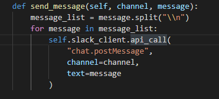

# rainbow-highlighter

Paint your code with rainbow-highlighter.  
After coding for a while, I just found out I just can't keep track of multiple variables at once.  
With this plugin, you can keep easily track of many variables by colors.

## Features

Press shift+alt+z, and variables curser is on will be highlighted. Press the same command again to remove highlights.  
Press shift+alt+a to remove all highlights.

## Extension Settings

`rainbow-highlighter.pallete`: Set of colors that will be used for highlighting.  
`rainbow-highlighter.background-alpha`: If you're using background, this value will be the alpha value for background.  
`rainbow-highlighter.use-border`: Use border rather than background, like gif above.

## Known Issues

highlighting a varaiable one split window and editing on another split window stops previously highlighted variables from updating.

## Release Notes

### 1.0.0

Initial release
